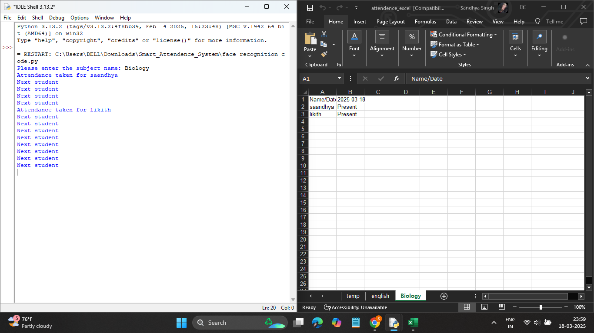

# Real-Time Face Recognition Attendance Tracking System

## 📌 Project Overview
This project is a **Real-Time Face Recognition Attendance Tracking System** that automates attendance marking using facial recognition. It utilizes **OpenCV, face_recognition, and Python** to detect and recognize faces from a live webcam feed, logging attendance in an Excel sheet.

## 🚀 Features
- 🎥 **Live Face Detection** using OpenCV.
- 🧠 **Face Recognition** using `face_recognition` library.
- 📊 **Automated Attendance Logging** in an Excel file.
- 🏷️ **Multiple Face Recognition** for different users.
- 🏎️ **Optimized Performance** by processing frames efficiently.

## 🛠️ Tech Stack
- **Programming Language**: Python
- **Libraries Used**: OpenCV, NumPy, face_recognition, xlwt, xlrd, xlutils

## 📥 Installation Guide
### Prerequisites
Ensure you have Python installed (Recommended: Python 3.10+). Install required dependencies:
```sh
pip install opencv-python numpy face_recognition xlwt xlrd xlutils
```

### Clone the Repository
```sh
git clone https://github.com/sandhyaasingh/Real-Time-Face-Recognition-Attendance-Tracking-System.git
cd Real-Time-Face-Recognition-Attendance-Tracking-System
```

## ▶️ How to Run the Project
1. **Add reference images** of users (e.g., `likith.png`, `saandhya.png`) in the project directory.
2. **Run the Python script**:
   ```sh
   python face_recognition_code.py
   ```
3. **Enter the subject name** when prompted.
4. **Sit in front of the camera**; the system will recognize and mark attendance in `attendence_excel.xls`.
5. **Press 'q' to quit** the program.

## 🖼️ Output


## 🔧 Future Improvements
- 📤 **Integration with Database** for better attendance management.
- 📧 **Email Notifications** for attendance reports.
- 📱 **Mobile App Integration** for remote attendance tracking.

---
*If you like this project, give it a ⭐!* 
